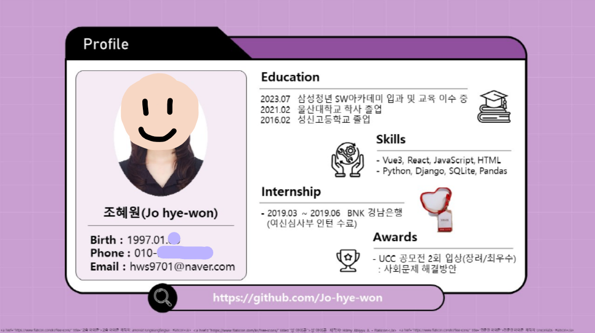

<!-- 
  -->

<!-- &color=B897FF -->
<!-- #  Welcome my github profile :wave: -->

<!-- # It's me!  -->

<!-- 

 -->

<!-- ## :deciduous_tree:  -->
<!--   -->

# How about visiting my velog?

<a href="https://velog.io/@turtle_hw" target="_blank">  

The latest article 💨 </a> 
<!-- 
Go to Velog 
 -->

<!--   -->
<!-- 
 -->

<!--   -->

<!-- 
 -->
 

<!-- 

GitHub stats

<!-- 
 -->
<!-- 
GitHub stats
 -->
<!-- Status

 -->

##  :purple_heart: Stack

<!--파이썬 -->
 _ 파이썬 기초 문법 및 응용 알고리즘 문제를 풀 수 있습니다.

<!-- CSS -->
 _ CSS 개념과 선택자 및 사용법을 알고 있습니다.

<!-- HTML -->
 _ HTML 요소, 구조 및 속성에 대해 이해하고 있습니다.

<!-- bootstrap -->
 _ bootstrap에서의 CSS 및 JS 사용법을 알고 응용할 줄 압니다.

<!-- Django -->
  - DRF 및 Django-rest-auth 사용 및 응용이 가능합니다.(Django-rest-auth를 사용한 프로젝트 진행경험 有)

<!-- vue.js -->
 _Router와 Pinia 사용법을 알고있으며 Single-File Components에 대해 이해하고 있습니다.(Vue3를 이용한 프로젝트 진행 경험 有)

<!-- 자바스크립트 -->
 _ 동기와 비동기를 이해하고 있으며 Eventhandler를 응용하여 사용할 줄 압니다.(Vue3를 이용한 프로젝트 진행 경험 有)

<!-- powershell -->
 _ ssafy강의장에서 bash창에서의 vue실행이 안되어 powershell 환경에서 vue 작업을 했습니다.

<!-- git -->
 _ git의 project에서 프로젝트 일정관리를 하였습니다

<!-- github -->
 _ 프로젝트 진행 시에 banch를 기능별로 만들어서 develop에서 merge를 진행하였으며 최종 완성본을 master에 merge하였습니다.
10회 이상의 merge conflict해결을 해보았습니다.

<!-- VSCode -->
 _ 주로 사용하는 편집기입니다. 다양한 익스텐션을 깔아서 사용하고 있습니다.  
    
    

<!-- 
 -->

